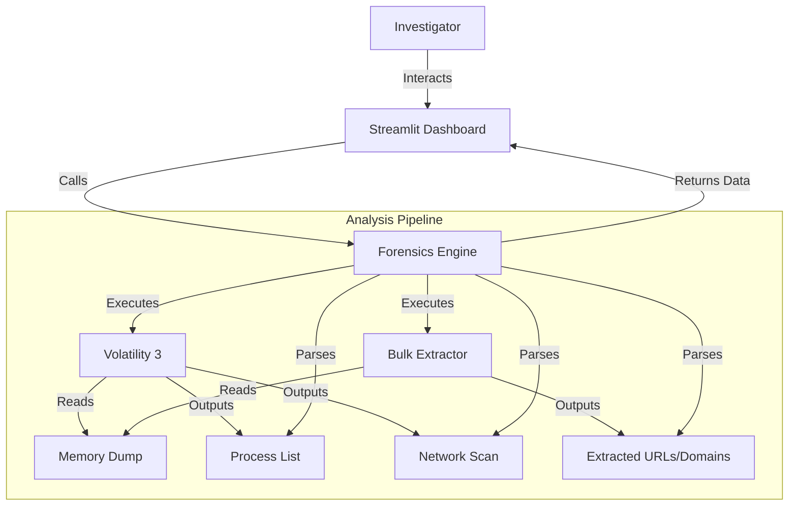

# Antigravity Forensics Pipeline

## 🕵️‍♂️ Project Overview
**Antigravity Forensics** is an end-to-end memory forensics analysis pipeline designed to investigate browser-based cybercrime. It specifically targets volatile memory dumps (`.dmp`) to extract artifacts like:
*   Running Processes (Browsers)
*   Network Connections
*   Opened URLs and Domain History
*   Suspicious Indicators (Phishing, Malware)

The projects wraps standard CLI forensic tools (**Volatility 3**, **Bulk Extractor**) into a unified Python engine and presents findings via a **Streamlit Dashboard** for investigators.

---

## 🏗️ Architecture



## 🚀 Setup & Installation

### Prerequisites
*   Python 3.10+
*   Windows (Host OS) or Linux
*   Administrator Privileges (for tool execution)

### 1. Installation
Run the following commands in PowerShell:

```powershell
# 1. Install Dependencies
pip install -r requirements.txt

# 2. Verify Tool Paths
# Ensure 'vol.py' is in c:/Major_Project/Tools/.../volatility3
# Ensure 'bulk_extractor64.exe' is in c:/Major_Project/Tools/.../bulk_extractor/win64
```

### 2. Running the Dashboard
```powershell
streamlit run dashboard/app.py
```
This will launch the GUI at `http://localhost:8501`.

---

## 🔍 Methodology

### 1. Memory Acquisition
*   **Tools**: DumpIt or FTK Imager.
*   **Target**: Host RAM (Volatile Memory).
*   **Artifact**: Raw `.dmp` file (e.g., 16GB).

### 2. Process analysis
*   **Tool**: Volatility 3 (`windows.pslist`, `windows.cmdline`).
*   **Goal**: Identify browser processes (`msedge.exe`, `chrome.exe`) and suspicious scripts (`powershell.exe`).

### 3. Network Correlation
*   **Tool**: Volatility 3 (`windows.netscan`).
*   **Goal**: Map process IDs to active TCP/UDP connections to identify communications with Command & Control (C2) servers or Phishing sites.

### 4. Artifact Scraping
*   **Tool**: Bulk Extractor.
*   **Goal**: Recover URLs, Emails, and Domain names from unallocated memory space. This is critical for finding artifacts from "Incognito/InPrivate" sessions where disk logs are disabled.

---

## ⚠️ Limitations
*   **Memory Size**: Large dumps (32GB+) require significant processing time (20+ mins for `netscan`).
*   **Encryption**: HTTPS traffic content cannot be decrypted without SSL keys, but DNS/SNI artifacts remain visible in memory strings.
